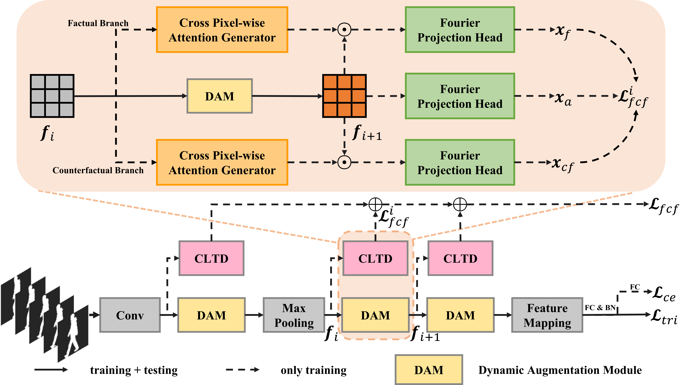
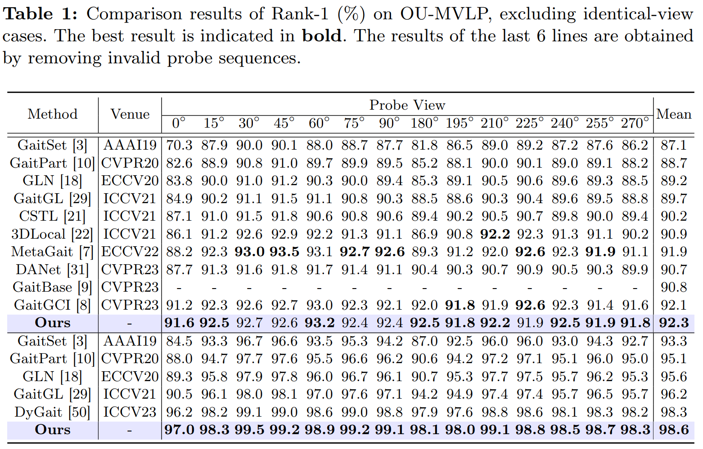
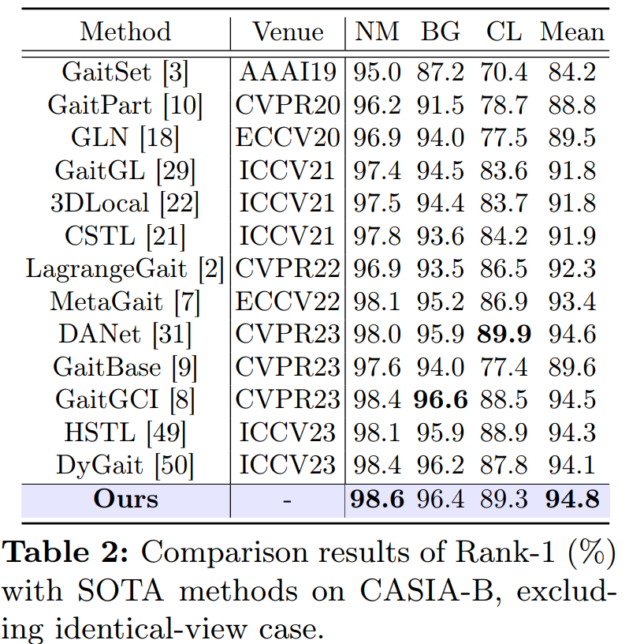
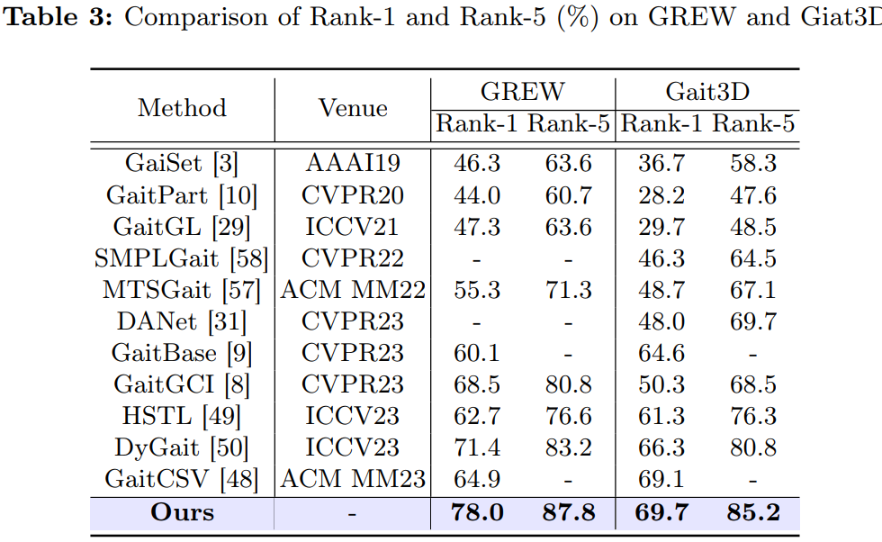

<div align="center">

# CLTD

## Causality-inspired Discriminative Feature Learning in Triple Domains for Gait Recognition

[Haijun Xiong](https://scholar.google.com/citations?hl=zh-CN&user=GDTyz2kAAAAJ),
[Bin Feng](https://scholar.google.com/citations?hl=zh-CN&user=nRc8u6gAAAAJ)  <sup>✉️</sup>,
[Wenyu Liu](https://scholar.google.com/citations?hl=zh-CN&user=nRc8u6gAAAAJ),
[Xinggang Wang](https://scholar.google.com/citations?hl=zh-CN&user=qNCTLV0AAAAJ)

[School of EIC, HUST](http://english.eic.hust.edu.cn/)

ArXiv Preprint ([arXiv 2024.12519](https://arxiv.org/abs/2407.12519))

<br>

**Our paper has been accepted at ECCV 2024. 🎉**


---
## Abstract

<div align="left">

Gait recognition is a biometric technology that distinguishes individuals by their walking patterns. However, previous methods face challenges when accurately extracting identity features because they often become entangled with non-identity clues. To address this challenge, we propose CLTD, a causality-inspired discriminative feature learning module designed to effectively eliminate the influence of confounders in triple domains, i.e., spatial, temporal, and spectral. Specifically, we utilize the Cross Pixel-wise Attention Generator (CPAG) to generate attention distributions for factual and counterfactual features in spatial and temporal domains. Then, we introduce the Fourier Projection Head (FPH) to project spatial features into the spectral space, which preserves essential information while reducing computational costs. Additionally, we employ an optimization method with contrastive learning to enforce semantic consistency constraints across sequences from the same subject. Our approach has demonstrated significant performance improvements on challenging datasets, proving its effectiveness. Moreover, it can be seamlessly integrated into existing gait recognition methods.


---
<div align="center">

## Framework




<div align="center">

## Results

<div align="left">

### 1.Results on OU-MVLP

<div align="center">



<div align="left">

### 2.Results on CASIA-B

<div align="center">



<div align="left">

### 3.Results on GREW & Gait3D

<div align="center">



<div align="left">


---
## Citation

<div align="left">

If you find our paper and code useful for your research, please consider giving this repo a star :star: or citing :pencil::

```BibTeX
@inproceedings{xiong2024causality,
  title={Causality-inspired Discriminative Feature Learning in Triple Domains for Gait Recognition},
  author={Xiong, Haijun and Feng, Bin and Wang, Xinggang and Liu, Wenyu},
  booktitle={European Conference on Computer Vision},
  year={2024},
  organization={Springer}
}
```

---

<div align="center">

## Acknowledgements

<div align="left">

The development of GaitGS is built on [OpenGait](https://github.com/ShiqiYu/OpenGait), and we are thankful for the remarkable work of the prior project.


